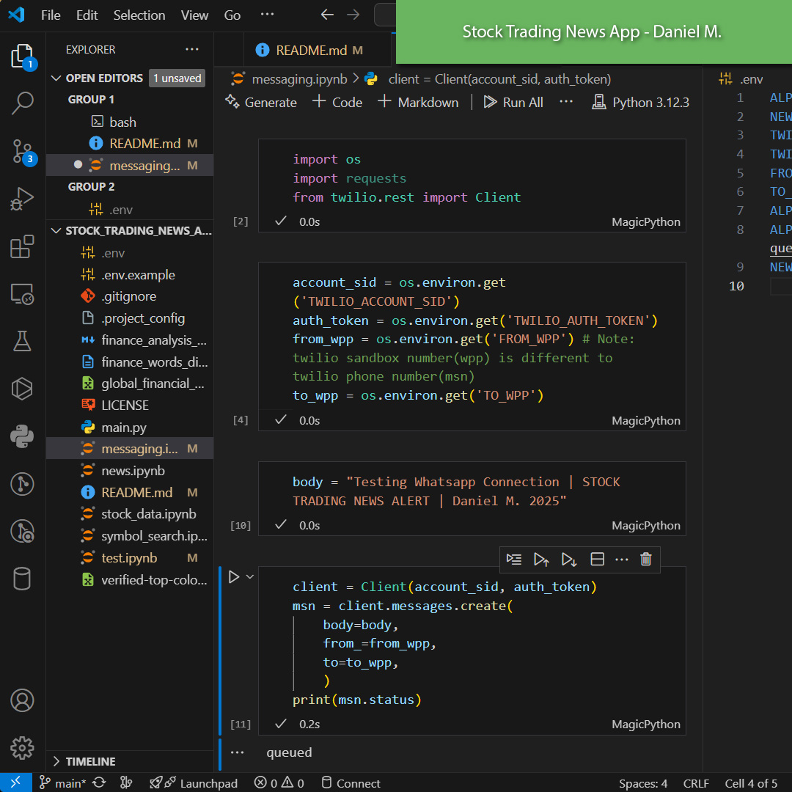

# Real-Time Stock Market News Alert System via WhatsApp

## Executive Summary
The **Real-Time Stock Market News Alert System** is an automated solution designed to keep investors informed about stock price movements and their causes. By integrating multiple APIs and deploying the system on the cloud, the project delivers daily stock-related news and price variations directly to stakeholders via WhatsApp.

## Problem Statement
Investors require timely and relevant information about stock price movements and the underlying causes. Manually tracking news and stock fluctuations can be time-consuming and inefficient. The goal is to automate this process by:
- Extracting real-time stock-related news
- Analyzing stock price variations
- Delivering structured alerts via WhatsApp

## Methodology & Approach
1. **Twilio**: Login to Twilio -> Go to send a whatsapp message -> Connect to  Whatsapp sandox -> Go to whatsapp -> Send confirmation 
message



Once connected, you can run the python file to send the message to the connected number


1. **Data Collection**: Fetch stock price and news data using APIs.
2. **Data Cleaning**: Process and structure data using **Pandas**.
3. **Message Formatting**: Extract key insights and structure messages.
4. **Automated Delivery**: Send messages via **Twilio**'s WhatsApp API.
5. **Deployment**: Schedule execution on the cloud for daily updates.

## Technical Architecture
**Components:**
- **APIs Used:**
  - [NewsAPI.org](https://newsapi.org) - Fetches stock-related news.
  - [Alpha Vantage](https://www.alphavantage.co) - Retrieves stock price data.
  - [Twilio](https://www.twilio.com/) - Sends WhatsApp messages.
- **Data Processing:** Pandas for data cleaning and structuring.
- **Automation & Deployment:** Cloud-based execution scheduler.

## Implementation Details
1. Retrieve stock price movements using Alpha Vantage.
2. Fetch relevant stock-related news from NewsAPI.
3. Clean and format data using Pandas.
4. Structure a WhatsApp message summarizing the stock movement and news.
5. Send the message to stakeholders using Twilio’s API.
6. Deploy on the cloud for scheduled execution at a predefined time daily.

## Results & Impact
- **Automated alerts** keep investors updated without manual tracking.
- **Faster decision-making** based on real-time market insights.
- **Scalability** through cloud deployment for multiple stock tracking.
- **Improved investor engagement** with timely updates.

## Future Recommendations
- Expand to cover multiple stocks in a single report.
- Implement sentiment analysis on news data for deeper insights.
- Allow users to customize stock tracking preferences.
- Integrate with Telegram and Email for multi-channel notifications.

## Technical Setup & Requirements
### Dependencies
- Python (>=3.8)
- Pandas
- Requests
- Twilio API
- Alpha Vantage API
- NewsAPI.org API
- Cloud scheduling service (e.g., AWS Lambda, Google Cloud Functions)

### Environment Variables
Set the following environment variables:
```
NEWS_API_KEY=your_news_api_key
ALPHA_VANTAGE_KEY=your_alpha_vantage_api_key
TWILIO_SID=your_twilio_sid
TWILIO_AUTH_TOKEN=your_twilio_auth_token
TWILIO_WHATSAPP_NUMBER=your_twilio_whatsapp_number
RECIPIENT_WHATSAPP_NUMBER=recipient_number
```

## Usage Instructions
1. Clone the repository.
2. Install dependencies:  
   ```bash
   pip install -r requirements.txt
   ```
3. Configure environment variables.
4. Run the script manually:
   ```bash
   python stock_alerts.py
   ```
5. Deploy to the cloud and set a daily execution schedule.

## Maintenance Guidelines
- Regularly update API keys.
- Monitor cloud execution logs for errors.
- Adjust stock symbols as needed.
- Ensure Twilio and API service quotas are sufficient.

## Required Skills
1. Python programming
2. API integration
3. Data cleaning with Pandas
4. Cloud deployment (AWS/GCP)
5. Automation & scheduling
6. WhatsApp API (Twilio)
7. Financial market analysis
8. Environment variable management
9. Error handling & logging
10. Data visualization (optional)

## SEO Keywords
- Real-time stock alerts
- Stock market news automation
- WhatsApp stock notifications
- Automated trading alerts
- Twilio WhatsApp API
- Financial data analysis
- Alpha Vantage stock data
- News API stock news
- Cloud-based stock tracking
- Python stock market bot

## References & Acknowledgments
- [NewsAPI.org](https://newsapi.org)
- [Alpha Vantage](https://www.alphavantage.co)
- [Twilio](https://www.twilio.com/)
- [Pandas Documentation](https://pandas.pydata.org/)
- [Python Requests Library](https://docs.python-requests.org/)